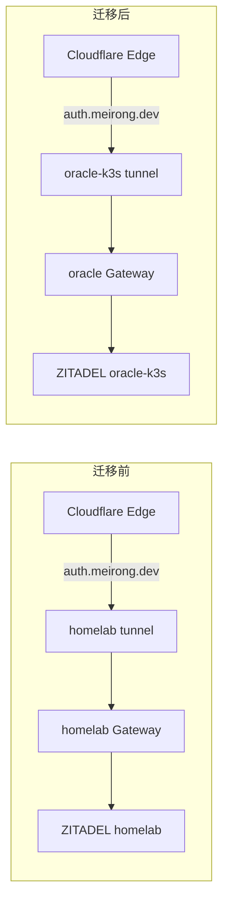

# ZITADEL 迁移至 oracle-k3s 计划

> 日期: 2026-07-04
> 状态: Pending（等待 106 恢复后执行）
> 背景: 106 服务器 (192.168.50.106) 暂时不可用，暴露 homelab NFS 单点依赖风险

## 1. 迁移动机

- 消除 ZITADEL 对 106 NFS 的单点依赖（当前 PostgreSQL 8Gi PVC 使用 `nfs-client` StorageClass）
- 利用 oracle-k3s 的 `local-path` 存储（比 NFS 更适合 PG 的同步写入模式）
- 双集群冗余：即使 homelab 整体不可用，OIDC 认证仍正常

## 2. 当前依赖关系

```
ZITADEL (homelab)
├── PostgreSQL 8Gi (nfs-client PVC → 106 NFS)
├── Vault secret/homelab/zitadel (masterkey, db-password)
│   └── Vault PVC 也在 106 NFS 上 (连锁依赖)
└── auth.meirong.dev
    ├── Cloudflare DNS CNAME → homelab tunnel
    ├── Cloudflare Tunnel ingress → homelab Gateway
    └── HTTPRoute → ZITADEL Service (homelab)
```

下游 OIDC 客户端（配 `https://auth.meirong.dev`，域名不变则无需改动）:
- Miniflux (oracle-k3s)
- Bifrost oauth2-proxy (homelab)
- ArgoCD (homelab)

## 3. 前置条件

- [ ] 106 服务器恢复，NFS 可用
- [ ] Vault 恢复，ZITADEL 对应 secret 可读
- [ ] 从 homelab ZITADEL PostgreSQL 成功 pg_dump

## 4. 迁移步骤

### Phase 1 — 在 oracle-k3s 上部署 ZITADEL

#### 4.1 密钥准备

在 Vault 中创建 Oracle 专用路径:
```
secret/oracle-k3s/zitadel
├── master-key: <同值>
└── db-password: <同值>
```

#### 4.2 创建 manifests

在 `cloud/oracle/manifests/` 下新增:
```
zitadel/
├── namespace.yaml
├── zitadel-db.yaml          # PostgreSQL HelmChart, storageClass: local-path, 8Gi
├── zitadel.yaml             # ZITADEL HelmChart
├── external-secrets.yaml    # ExternalSecrets for masterkey + postgres auth
├── gateway-route.yaml       # HTTPRoute: auth.meirong.dev → ZITADEL
└── kustomization.yaml       # 加入 kustomize 树
```

关键配置变更（vs homelab 版）:

| 项目 | homelab | oracle-k3s |
|------|---------|------------|
| StorageClass | `nfs-client` | `local-path` |
| Vault key path | `secret/homelab/zitadel` | `secret/oracle-k3s/zitadel` |
| ESO ClusterSecretStore | 同集群 Vault | `vault-backend` (Tailscale → homelab Vault) |
| ExternalDomain | `auth.meirong.dev` | 不变 |
| Gateway parentRef | `homelab-gateway` | `oracle-gateway` |

#### 4.3 部署 + 数据导入

```bash
# 1. 在 homelab 上导出数据
kubectl exec -n zitadel deploy/zitadel-db-postgresql -- \
  pg_dump -U zitadel zitadel > zitadel-dump.sql

# 2. 在 oracle-k3s 上部署
kubectl apply -k cloud/oracle/manifests/

# 3. 等待 PostgreSQL 就绪后导入数据
kubectl exec -n zitadel deploy/zitadel-db-postgresql -- \
  psql -U zitadel -d zitadel < zitadel-dump.sql
```

### Phase 2 — DNS 切换

#### 2.1 流量切换方案



#### 2.2 操作步骤

1. **在 Cloudflare Dashboard 中**：
   - oracle-k3s tunnel ingress 添加 `auth.meirong.dev` → `http://cilium-gateway-oracle-gateway.kube-system.svc:80`
   - homelab tunnel ingress 暂时保留 `auth.meirong.dev`

2. **切换 DNS**：
   - `auth.meirong.dev` 的 CNAME 从 `homelab-tunnel.cfargotunnel.com` 改为 `oracle-tunnel.cfargotunnel.com`
   - TTL 1 分钟（已配），等待传播

3. **验证**：
   - `curl -sI https://auth.meirong.dev` 返回 200
   - OIDC discovery endpoint (`/.well-known/openid-configuration`) 正常
   - 任一 OIDC client 能完成登录（Miniflux 或 Bifrost）

4. **清理**：
   - 从 homelab tunnel ingress 移除 `auth.meirong.dev`
   - 验证 homelab 上的 ZITADEL 不再收到流量

### Phase 3 — 清理 homelab ZITADEL

- 删除 `k8s/helm/manifests/zitadel.yaml`
- 删除 homelab 的 ZITADEL PostgreSQL PVC（数据已迁移）
- 从 `argocd/applications/zitadel.yaml` 中移除或标注为已弃用
- 从 `k8s/helm/manifests/gateway.yaml` 移除 `auth.meirong.dev` 的 HTTPRoute

## 5. 风险与缓解

| 风险 | 影响 | 缓解 |
|------|------|------|
| pg_dump 后到 DNS 切换间的增量数据丢失 | 用户/应用配置变更丢失 | ZITADEL 非高频写入；可在切换前暂停外部登录，或将 DNS TTL 临时设低后再做最终 pg_dump |
| Vault 在 106 恢复后仍不可用 | ESO 无法同步 secret | 手动创建 K8s Secret（bootstrap 模式） |
| OIDC 签发 key 变更 | 现有 JWT token 失效，所有已登录用户需要重新认证 | 迁移时确认 ZITADEL masterkey 一致（同值），PG 数据库一致（含加密 key），则签发 key 不变 |
| oracle-k3s Cloudflare Tunnel 不含 `auth.meirong.dev` ingress | 流量到了 tunnel 但返回 404 | 在 Cloudflare Dashboard 手动添加后再切 DNS |

## 6. 参考文档

- ZITADEL 当前部署: `k8s/helm/manifests/zitadel.yaml`
- ZITADEL Helm values: `k8s/helm/values/postgresql-values.yaml`
- oracle-k3s 已有模式参考: `cloud/oracle/manifests/rss-system/miniflux.yaml` (PG + app 部署)
- oracle-k3s Cloudflare Tunnel: `cloud/oracle/manifests/base/cloudflare-tunnel.yaml`
- homelab Cloudflare Tunnel 配置: `cloudflare/terraform/variables.tf` (`ingress_rules`)
- 架构总览: `docs/README.md`
